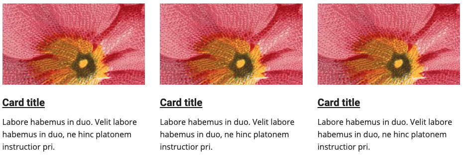

# TNA frontend design toolkit

## Cards



### Usage
```html
<div class="col-4">
    <article class="tna-card">
        <a href="#" class="tna-card__link">
            <div class="tna-card__image">
                ...
            </div>
            <div class="tna-card__body">
                ...
            </div>
        </a>
    </article>
</div>
```