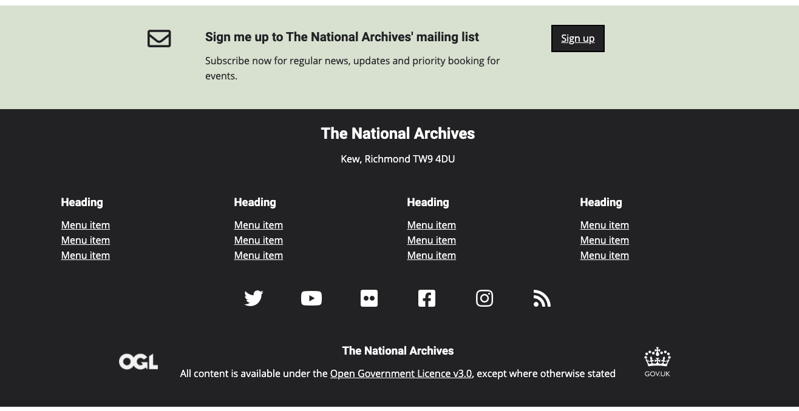

# TNA frontend design toolkit

## Footer



### Usage
```html
<footer class="tna-footer">
    <div class="tna-footer__subscribe tna-bg--green">
        <div class="container">
            <div class="row justify-content-md-center py-3">
                <div class="col-md-1">
                    <i class="far fa-envelope h1"></i>
                </div>
                <div class="col-md-6">
                    <h4 class="h3">Sign me up to The National Archives' mailing list</h4>
                    <p>Subscribe now for regular news, updates and priority booking for events.</p>
                </div>
                <div class="col-md-2">
                    <a href="#" class="mt-md-3 tna-button">Sign up</a>
                </div>
            </div>
        </div>
    </div>
    <div class="tna-footer__content tna-bg--dark">
        <div class="container">
            <div class="row">
                <div class="col-md-12 text-center">
                    <h3 class="h2">The National Archives</h3>
                    <p>Kew, Richmond TW9 4DU</p>
                </div>
            </div>
            <div class="row">
                <div class="col-6 col-md-3">
                    <h4>Heading</h4>
                    <ul class="tna-ul--no-bullet">
                        <li><a href="">Menu item</a></li>
                    </ul>
                </div>
                <div class="col-6 col-md-3">
                    <h4>Heading</h4>
                    <ul class="tna-ul--no-bullet">
                        <li><a href="">Menu item</a></li>
                    </ul>
                </div>
                <div class="col-6 col-md-3">
                    <h4>Heading</h4>
                    <ul class="tna-ul--no-bullet">
                        <li><a href="">Menu item</a></li>
                    </ul>
                </div>
                <div class="col-6 col-md-3">
                    <h4>Heading</h4>
                    <ul class="tna-ul--no-bullet">
                        <li><a href="">Menu item</a></li>
                    </ul>
                </div>
            </div>
            <div class="row justify-content-md-center mb-5 mt-3 text-center tna-footer__social-media-links">
                <div class="col-4 col-sm-4 col-md-1">
                    <i class="fab fa-twitter"></i>
                </div>
                <div class="col-4 col-sm-4 col-md-1">
                    <i class="fab fa-youtube"></i>
                </div>
                <div class="col-4 col-sm-4 col-md-1">
                    <i class="fab fa-flickr"></i>
                </div>
                <div class="col-4 col-sm-4 col-md-1">
                    <i class="fab fa-facebook-square"></i>
                </div>
                <div class="col-4 col-sm-4 col-md-1">
                    <i class="fab fa-instagram"></i>
                </div>
                <div class="col-4 col-sm-4 col-md-1">
                    <i class="fas fa-rss"></i>
                </div>
            </div>
            <div class="row justify-content-md-center pb-3">
                <div class="col-md-1 text-center">
                    
                </div>
                <div class="col-md-8 text-center">
                    <h4 class="mt-0">The National Archives</h4>
                    <p>
                        All content is available under the
                        <a href="http://www.nationalarchives.gov.uk/doc/open-government-licence/"
                           title="External website - opens in a new window" target="_blank">
                            Open Government Licence v3.0</a>, except where otherwise stated
                    </p>
                </div>
                <div class="col-md-1 text-center">
                    <a title="External website - opens in a new window" href="http://gov.uk/" target="_blank" rel="noopener noreferrer">
                        
                        <span class="sr-only">Opens a new window</span>
                    </a>
                </div>
            </div>
        </div>
    </div>
</footer>
```