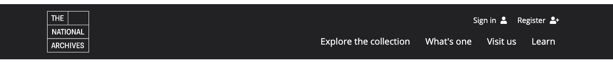

# TNA frontend design toolkit

## Header



### Usage
```html
<header class="tna-header tna-bg--dark">
    <div class="container">
        <div class="row">
            <div class="col-3">
                <a href="#">
                    
                </a>
            </div>
            <div class="col-9">
                <div class="row">
                    <div class="col">
                        <nav class="tna-header__nav tna-header__nav-secondary" role="navigation">
                            <ul class="tna-header__nav-list ml-auto">
                                <li>
                                    <a class="tna-header__nav-link" href="#">
                                        <span>Sign&nbsp;in</span> <i class="fas fa-user"></i>
                                    </a>
                                </li>
                                <li>
                                    <a class="tna-header__nav-link" href="#">
                                        <span>Register</span> <i class="fas fa-user-plus"></i>
                                    </a>
                                </li>
                                <li class="d-md-none">
                                    <a class="tna-header__nav-link" href="#">
                                        <span>Menu</span> <i class="fas fa-bars"></i>
                                    </a>
                                </li>
                            </ul>
                        </nav>
                    </div>
                </div>
                <div class="row">
                    <div class="col">
                        <nav class="tna-header__nav tna-header__nav-primary" role="navigation">
                            <ul class="tna-header__nav-list ml-auto">
                                <li>
                                    <a class="tna-header__nav-link" href="#">
                                        <span>Explore the collection</span>
                                    </a>
                                </li>
                                <li>
                                    <a class="tna-header__nav-link" href="#">
                                        <span>What's one</span>
                                    </a>
                                </li>
                                <li>
                                    <a class="tna-header__nav-link" href="#">
                                        <span>Visit us</span>
                                    </a>
                                </li>
                                <li>
                                    <a class="tna-header__nav-link" href="#">
                                        <span>Learn</span>
                                    </a>
                                </li>
                            </ul>
                        </nav>
                    </div>
                </div>
            </div>
        </div>
    </div>
</header>
```