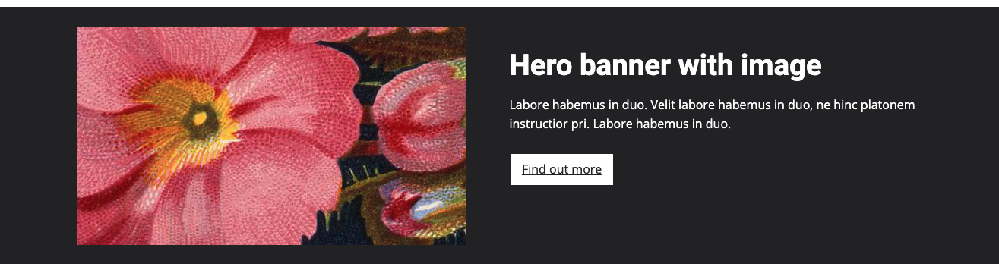
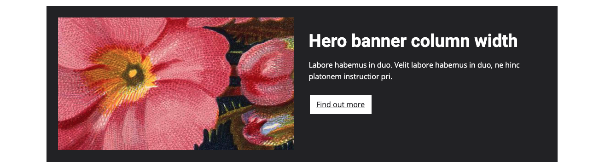

# TNA frontend design toolkit

## Hero banners



### Usage
```html
<div class="tna-hero-banner tna-hero-banner--dark">
    <div class="container">
        <div class="row">
            <div class="col-6">
                <div class="tna-hero-banner__image">
                    
                </div>
            </div>
            <div class="col-6">
                <div class="tna-hero-banner__content">
                    <h3 class="h1">Hero banner with image</h3>
                    <p>Labore habemus in duo. Velit labore habemus in duo.</p>
                    <p><a href="#" class="tna-button tna-button--primary">Find out more</a></p>
                </div>
            </div>
        </div>
    </div>
</div>
```


### Usage
```html
<div class="tna-hero-banner tna-hero-banner--dark">
    <div class="container">
        <div class="row">
            <div class="col-12">
                <div class="tna-hero-banner__content">
                    <h3 class="h1">Hero banner without image</h3>
                    <p>Labore habemus in duo. Velit labore habemus in duo.</p>
                    <p><a href="#" class="tna-button tna-button--primary">Find out more</a></p>
                </div>
            </div>
        </div>
    </div>
</div>
```



### Usage
```html
<div class="container">
    <div class="row">
        <div class="col-12">
            <div class="tna-hero-banner tna-hero-banner--dark">
                <div class="row">
                    <div class="col-6">
                        <div class="tna-hero-banner__image">
                            
                        </div>
                    </div>
                    <div class="col-6">
                        <div class="tna-hero-banner__content">
                            <h3 class="h1">Hero banner column width</h3>
                            <p>Labore habemus in duo. Velit labore habemus in duo.</p>
                            <p><a href="#" class="tna-button tna-button--primary">Find out more</a></p>
                        </div>
                    </div>
                </div>
            </div>
        </div>
    </div>
</div>
```
