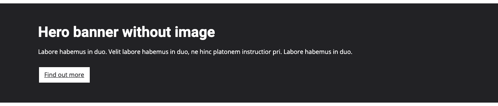

# TNA frontend design toolkit

## Hero banners


### Usage
```html
<div class="tna-hero-banner tna-bg--dark">
    <div class="container">
        <div class="row">
            <div class="col-6">
                <div class="tna-hero-banner__image">
                    ...
                </div>
            </div>
            <div class="col-6">
                <div class="tna-hero-banner__body">
                    ...
                </div>
            </div>
        </div>
    </div>
</div>
```



### Usage
```html
<div class="tna-hero-banner tna-bg--dark">
    <div class="container">
        <div class="row">
            <div class="col-12">
                <div class="tna-hero-banner__body">
                    ...
                </div>
            </div>
        </div>
    </div>
</div>
```


### Usage
```html
<div class="container">
    <div class="row">
        <div class="col-12">
            <div class="tna-hero-banner tna-bg--dark">
                <div class="row">
                    <div class="col-6">
                        <div class="tna-hero-banner__image">
                            ...
                        </div>
                    </div>
                    <div class="col-6">
                        <div class="tna-hero-banner__body">
                            ...
                        </div>
                    </div>
                </div>
            </div>
        </div>
    </div>
</div>
```
